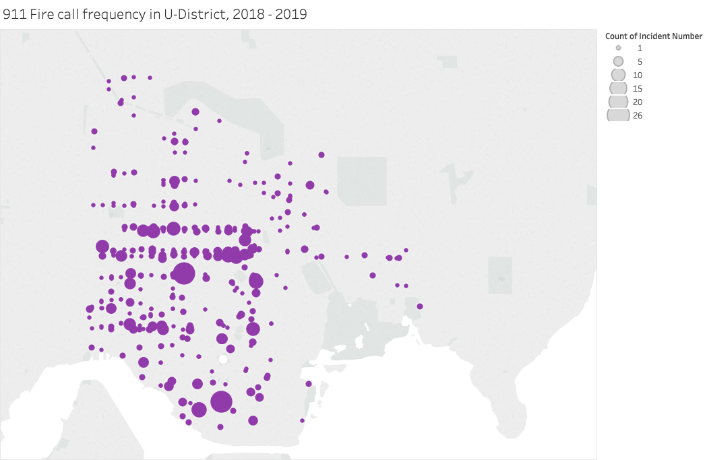

# U-District Fire Responses
## Working Title: Demonstrating Organized Information of Fire Calls of U-District  
### Team members:
Brandon Miller, Jiaxin Wang, Wayne Wang

### Affiliation:
Info-201: Technical Foundations of Informatics
The Information School
University of Washington
Autumn 2019

## 1.0 Introduction
### 1.1 Problem Situation:
The main stakeholders are the fire department employees, officials, and individuals who live or frequently commute within the fire department’s response territory. The setting for our problem is that fire department members and officials care about people’s safety and want to improve their ability to quickly dispatch. People who live, travel and commute around the U-District may also want to acquire information about the level of safety regarding fire incidents. Fire departments want to utilize their resources to be as prepared as possible for any possible incidents. It is likely that certain areas are more or less prone to emergencies and require more or less attention from the fire department.

### 1.2 What is the problem?
With the unpredictability of fire calls, it is hard for fire department members and officials to predict when they will receive calls and where the incident will occur. This has the potential to delay incident response times, especially when experiencing a high volume of calls. Civilians who live in this area are directly affected by how well the fire department responds, and more cautious citizens may use the information in planning where they spend their time.

### 1.3 Why does it matter?
If fire department members and officials use organized information on fire calls they can predict which locations are of higher risk and pay more attention to that location, thus improving their ability to respond to emergency situations as soon as possible. If people who live in and travel around the area acquire organized information of fire calls, they can use caution in specific locations and timely adjust their living plans to improve their safety.

### 1.4 How it will be addressed?
We plan to create data visualizations that show various information on fire calls in the U-District area, such as the number of fire calls received, locations of fire calls, and frequency of fire calls at different times of day. We also plan to compare the frequency of non-fire incidents that occurred in the area relative to fire incidents. Additionally, we will demonstrate how data about fire calls can help fire department members and officials solve challenges by reaching a data-driven solution.

## 2.0 Research Questions
**What parts of the U-district are at higher risk of incidents necessitating a fire call? What about at different times of the year?**

**What categories of fire call incidents are most common, and how is this changing?**

## 3.0 Possible data sets
**Seattle Police Department 911 incident Response.** -- This dataset record the 911 police responses in Seattle from 2009 to 2017. It includes data such as event number, event type, date and locations. We can utilize this dataset by analyzing the distribution of incidents based on areas and time. We could also analyze the percentage of fire calls among all 911 calls in various areas.  
_**Attributes:**_ 19 , _**Observations:**_ 1433826  
<https://www.kaggle.com/sohier/seattle-police-department-911-incident-response>

**Seattle Real Time Fire 911 Calls** -- This is a real time database records Seattle Fire Department’s 911 dispatches. The duration of this dataset is from 2003 to now. This dataset includes data of incidents’ address, types, datetime and locations. This dataset can be used to analyze the fire call frequency from time to time as well as identify the area with more frequent fire calls.  
_**Attributes:**_ 7 , _**Observations:**_  1.41M  
<https://data.seattle.gov/Public-Safety/Seattle-Real-Time-Fire-911-Calls/kzjm-xkqj>

## 4.0 Information Visualizations

This graphic is a map showing the total fire calls occurrences around U-District from 2018-2019. The purple dots represent the occurrence of fire call on its location, and the size of dots represents the total occurrences (larger dot for larger number).  

This graphic is a histogram shows the number of incidents occurred around U-District from 2014 - 2017. To be more specific, this graphic shows the total number of incidents by quarters of the year. This could help researchers to find the potential relationship between seasons and the frequency of incident calls.

## 5.0 Team Coordination
#### a) Weekly Meeting Time:
We will meet every Tuesday from 11:30 - 1:30 & every Friday from 11:30 - 12:30  

#### b) Individual Goals:
* Brandon Miller: I plan to help generate ideas and facilitate discussion within the group with a focus on how our solution can affect people. I aim to learn how to efficiently cooperate on a Github repository as well as some of the technical aspects behind categorizing data and data visualization.
* Jiaxin Wang: wants to learn R programming and data visualization and connect them with real problems in life.  
* Wayne Wang: I would like to learn how to use R to clean and analyze existing datasets as well as to identify real-world problems from data analysis. My role is to generate visualizations and to make sure our work function properly on Github.

#### c) Communication
We will work together during the team working time we agreed upon. In addition, we will communicate via Microsoft Teams remotely to exchange ideas.  

#### d) Feedback & Collaboration
Constructive and honest feedback will be given to keep everyone accountable. We will respect each other's contributions and opinions. If an issue arises we will first attempt to communicate with each other, and only if that is unsuccessful will we notify our TA that we need guidance.

## 6.0 Questions for Teaching Team
We don't have any questions so far.

## 7.0 References
[1] <https://www.kaggle.com/sohier/seattle-police-department-911-incident-response/download>  
[2] <https://data.seattle.gov/Public-Safety/Seattle-Real-Time-Fire-911-Calls/kzjm-xkqj>
